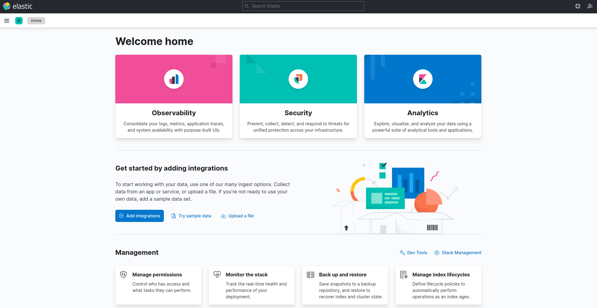
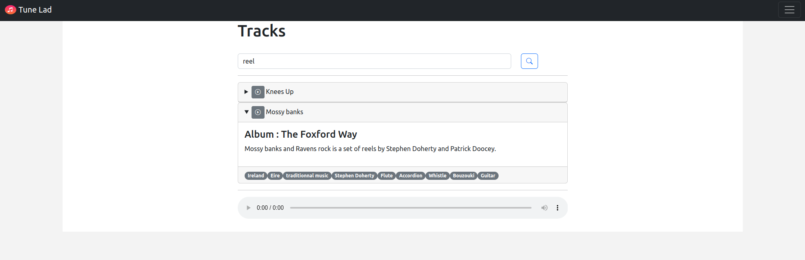
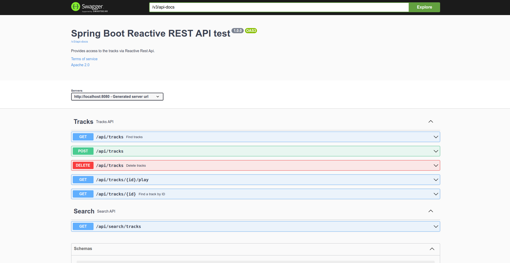

= Tune Lad (playground)
//:doctype: book
:sectnums:
//:source-highlighter: highlightjs
:idprefix:
:idseparator: -
:sectlinks:
:sectanchors:
//:linkcss: false
:allow-uri-read:
// :imagesdir: ./doc/images

:icon-party: &#x1F973;

ifndef::env-github[:icons: font]
ifdef::env-github[]
:status:
:outfilesuffix: .adoc
:caution-caption: :fire:
:important-caption: :exclamation:
:note-caption: :paperclip:
:tip-caption: :bulb:
:warning-caption: :warning:
endif::[]
// Vars
:project-group-id: org.tunelad
:project-artifact-id: tunelad
:project-version: 0.0.1-SNAPSHOT
:orga: uguy
:uri-org: https://github.com/{orga}
:uri-repo: {uri-org}/{project-artifact-id}
:uri-issues: {uri-repo}/issues
:uri-contributors: {uri-repo}/graphs/contributor
:uri-rel-file-base: link:
:uri-rel-tree-base: link:
ifdef::env-site,env-yard[]
:uri-rel-file-base: {uri-repo}/blob/master/
:uri-rel-tree-base: {uri-repo}/tree/master/
endif::[]
:uri-changelog: {uri-rel-file-base}CHANGELOG.adoc
:uri-contribute: {uri-rel-file-base}CONTRIBUTING.adoc
:uri-license: {uri-rel-file-base}LICENSE

ifdef::status[]
image:{uri-repo}/workflows/workflow-build/badge.svg[Build,link="{uri-repo}/actions?query=workflow%3Aworkflow-build"]
image:https://img.shields.io/badge/License-GPL%20v3-yellow.svg[License,link="{uri-license}"]
endif::[]

Dummy project used as a playground for things like https://docs.spring.io/spring-modulith/docs/current/reference/html/[Spring Modulith], https://docs.spring.io/spring-framework/docs/current/reference/html/web-reactive.html[WebFlux], https://swagger.io/specification/[OpenAPI], https://svelte.dev/docs[Svelte JS], etc.

This simple app allows to store an mp3 file with some description and play it via the browser `<audio>` html element.

'''

== Features

* Upload a track with description
* List tracks with basic search
* Play track from browser (streaming bytes with range support)

== Developing

=== Prerequisite

- a git client
- a java (jdk17 or higher)
- maven (optional if you choose to use https://github.com/takari/maven-wrapper[maven wrapper script])
- Docker for integration tests

=== Building

This is a standard maven project. To build the application as fat jar, simply execute:

[source,bash,subs="attributes"]
----
git clone {uri-repo}.git
cd {project-artifact-id}/
mvn package
----

The build should produce under the `target/` folder (and in your local maven repository) a jar archive named `{project-artifact-id}-{project-version}.jar`

For more details about apache maven, please refer to the https://maven.apache.org/guides/getting-started/[documentation]

== Running the application

=== Prerequisite

The application depends on Elasticsearch (ES). You can start one by running docker compose from the root folder.

[source,bash,subs="attributes"]
----
docker compose up -d
----

ES should be available at http://localhost:9200

.GET http://localhost:9200 sample output
[source,json,subs="attributes"]
----
{
    "name" : "641f2b1d9694",
    "cluster_name" : "docker-cluster",
    "cluster_uuid" : "S2nCHRc7Smi4ZR-ZzOiIlA",
    "version" : {
        "number" : "8.5.3",
        "build_flavor" : "default",
        "build_type" : "docker",
        "build_hash" : "4ed5ee9afac63de92ec98f404ccbed7d3ba9584e",
        "build_date" : "2022-12-05T18:22:22.226119656Z",
        "build_snapshot" : false,
        "lucene_version" : "9.4.2",
        "minimum_wire_compatibility_version" : "7.17.0",
        "minimum_index_compatibility_version" : "7.0.0"
    },
    "tagline" : "You Know, for Search"
}
----

Kibana UI should also be available at http://localhost:5601/

== Configuration

=== H2 database

For simplicity, we use a simple file based H2 database. Data file are store under `target` folder. H2 web console is available at http://localhost:8082.

If you want to use another SGBD, add the maven dependency to the corresponding driver and update configuration in `application.yml` file
[source, yaml]
----
include::./src/main/resources/application.yml[lines=8..15]
----

=== Elasticsearch

ES connection use spring-boot default configuration ( localhost:9200 ). If you want to customize it, please refer to the https://docs.spring.io/spring-boot/docs/current/reference/html/data.html#data.nosql.elasticsearch.connecting-using-rest[spring-boot documentation] and update `application.yml` file

.ES connection sample configuration
[source,yaml,subs="attributes"]
----
spring:
  elasticsearch:
    uris: "localhost:9200"
    socket-timeout: "10s"
    username: "user"
    password: "secret"
----

== UI

=== Tune Lad

Application is available at http://localhost:8080

=== Swagger UI

Swagger UI is available at http://localhost:8080/swagger-ui.html

== Getting Help

The *{orga}* organization on GitHub hosts the project's source code, issue trackers, and other projects.

Source repository (git):: {uri-repo}
Issue tracker:: {uri-issues}
Organization on GitHub:: {uri-org}

== Copyright and License

Use of this software is granted under the terms of the GNU GENERAL PUBLIC LICENSE.

See the {uri-license}[LICENSE] for the full license text.

== Links

- Project homepage: {uri-org}/{project-artifact-id}/
- Repository: {uri-org}/{project-artifact-id}/
- Issue tracker: {uri-org}/{project-artifact-id}/issues. +
