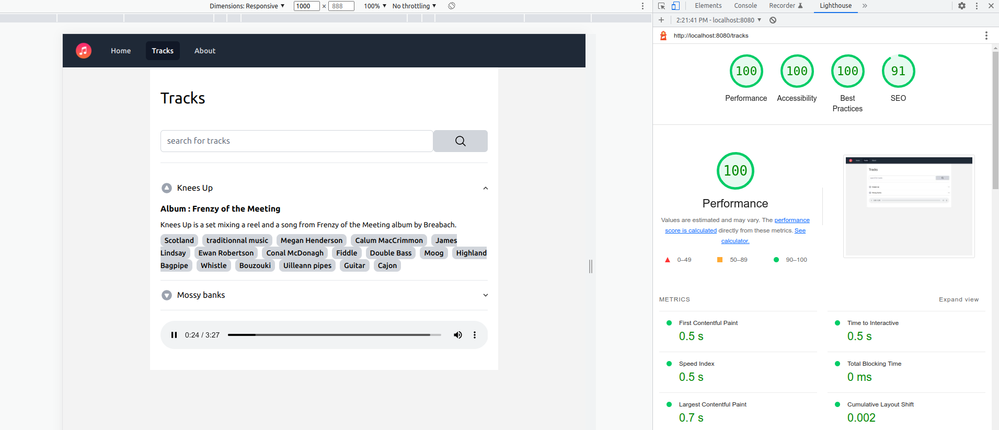

= Tune Lad (playground)
//:doctype: book
:sectnums:
//:source-highlighter: highlightjs
:idprefix:
:idseparator: -
:sectlinks:
:sectanchors:
//:linkcss: false
:allow-uri-read:
// :imagesdir: ./doc/images

:icon-party: &#x1F973;

ifndef::env-github[:icons: font]
ifdef::env-github[]
:status:
:outfilesuffix: .adoc
:caution-caption: :fire:
:important-caption: :exclamation:
:note-caption: :paperclip:
:tip-caption: :bulb:
:warning-caption: :warning:
endif::[]
// Vars
:project-group-id: org.tunelad
:project-artifact-id: tunelad
:project-version: 0.0.1-SNAPSHOT
:orga: uguy
:uri-org: https://github.com/{orga}
:uri-repo: {uri-org}/{project-artifact-id}
:uri-issues: {uri-repo}/issues
:uri-contributors: {uri-repo}/graphs/contributor
:uri-rel-file-base: link:
:uri-rel-tree-base: link:
ifdef::env-site,env-yard[]
:uri-rel-file-base: {uri-repo}/blob/master/
:uri-rel-tree-base: {uri-repo}/tree/master/
endif::[]
:uri-changelog: {uri-rel-file-base}CHANGELOG.adoc
:uri-contribute: {uri-rel-file-base}CONTRIBUTING.adoc
:uri-license: {uri-rel-file-base}LICENSE

image::./app/static/images/icon-144x144.png[Tune Lad,link="{uri-repo}",width=200px,role=related thumb right]

ifdef::status[]
image:{uri-repo}/actions/workflows/workflow-build.yml/badge.svg?branch=main[Build,link="{uri-repo}/actions?query=workflow%3Aworkflow-build+branch%3Amain"]
image:https://img.shields.io/badge/License-GPL%20v3-yellow.svg[License,link="{uri-license}"]
endif::[]

Dummy project used as a playground for things like https://docs.spring.io/spring-modulith/docs/current/reference/html/[Spring Modulith], https://docs.spring.io/spring-framework/docs/current/reference/html/web-reactive.html[WebFlux], https://swagger.io/specification/[OpenAPI], https://kit.svelte.dev/docs/introduction[SvelteKit], https://tailwindcss.com/[Tailwind CSS], etc.

This simple app allows to store an mp3 file with some description and play it via the browser `<audio>` html element.

'''

== Features

* Upload a track with description
* List tracks with basic search
* Play track from browser (streaming bytes with range support)
* OpenAPI v3 endpoint
* Spring boot actuator features (health, info, etc.)
* Mobile friendly
* PWA support
* Lighthouse score follow up

== Developing

=== Prerequisite

- a git client
- a java (jdk25 or later)
- maven (optional if you choose to use https://github.com/takari/maven-wrapper[maven wrapper script])
- Docker and Docker Compose
- NodeJS v24.11.1 (npm v11.6.2) or later

=== Building

==== Backend

This is a standard maven project. To build the application as fat jar, simply execute:

[source,bash,subs="attributes"]
----
git clone {uri-repo}.git
cd {project-artifact-id}/
./mvnw package
----

The build should produce under the `target/` folder (and in your local maven repository) a jar archive named `{project-artifact-id}-{project-version}.jar`

For more details about apache maven, please refer to the https://maven.apache.org/guides/getting-started/[documentation]

==== Frontend

The frontend source code lives in `<project root>/app` folder.

Svelte frontend is build during maven backend build but if your want livereload for UI development this command will run the frontend app in dev mode.

[source,bash,subs="attributes"]
----
npm run dev -- --open
----

You should format frontend resource by running the following command (todo: make this a git commit hook).

[source,bash,subs="attributes"]
----
npm run format
----

== Running the application

=== Prerequisite

The application depends on MongoDB. You can start an instance by running docker compose from the root folder.

[source,bash,subs="attributes"]
----
docker compose up -d
----

Mongo Express (a MongoDB web UI) should be available at http://localhost:8081

== Configuration

=== MongoDB database

MongoDB configuration lives in the `application.yml` file. `Track` documents are stored in a regular collection names `tracks` but audio files are stored in MongoDB GridFS system. The application also uses in a simple way MongoDB fulltext search capabilities when looking for tracks.

[source, yaml]
----
spring:
    mongodb:
    database: 'tunelad'
    password: 'tunelad'
    username: 'tunelad'
    authentication-database: 'admin'
    host: 'localhost'
    port: 27017
----

== UI

=== Tune Lad

Application is available at http://localhost:8080

You can load some sample by running import method on test class `org.tunelad.ImporterTest` xref:src/test/java/org/tunelad/ImporterTest.java[src/test/java/org/tunelad/ImporterTest.java].

=== Swagger UI

Swagger UI is available at http://localhost:8080/swagger-ui.html

== Getting Help

The *{orga}* organization on GitHub hosts the project's source code, issue trackers, and other projects.

Source repository (git):: {uri-repo}
Issue tracker:: {uri-issues}
Organization on GitHub:: {uri-org}

== Copyright and License

Use of this software is granted under the terms of the GNU GENERAL PUBLIC LICENSE.

See the {uri-license}[LICENSE] for the full license text.

== Links

- Project homepage: {uri-org}/{project-artifact-id}/
- Repository: {uri-org}/{project-artifact-id}/
- Issue tracker: {uri-org}/{project-artifact-id}/issues. +
